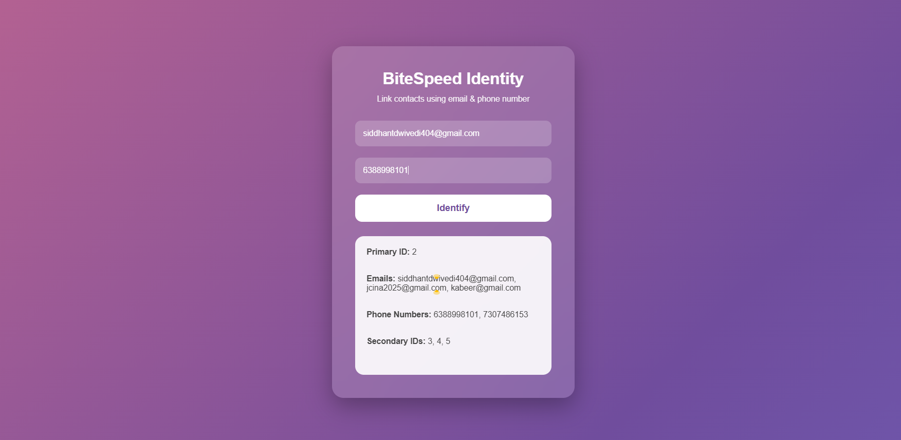

# ⚡ BiteSpeed: Identity Reconciliation System

A full-stack solution built to solve the **Identity Reconciliation** challenge. This system identifies and links different contact information (emails/phone numbers) belonging to the same individual, creating a unified customer profile.

---

## 🚀 Live Deployment
**Check out the live project here:** [https://bitespeed-identity-4.onrender.com]

---

## 🛠️ Tech Stack (Full-Stack)

| Layer | Technology |
| :--- | :--- |
| **Frontend** | React.js, Tailwind CSS, Axios |
| **Backend** | Node.js, Express.js |
| **Database** | SQLite (Sequelize ORM) |
| **Tools** | Git/GitHub, Postman (API Testing) |

---

## 📁 Project Overview & Screenshots

The project is divided into a **Frontend** for user interaction and a **Backend** that handles the core reconciliation logic. 

You can find the visual walkthrough of the API and UI in the `backend/screenshots` folder.

### **System Preview**

| Application UI | API Logic / Database |
| :---: | :---: |

|  |  |
| *User Interface for Contact Submission* | *Identity Reconciliation Flow* |

---

## 🏗️ Core Logic: The `/identify` Endpoint

The backend implements a sophisticated linking algorithm:
1. **Primary Contact:** Created when a completely new user interacts.
2. **Secondary Contact:** Created when a user provides a new email/phone that matches an existing record.
3. **Merging:** If two primary contacts are linked by a new order, one is downgraded to "secondary" to maintain a single source of truth.

---

## ⚙️ How to Run Locally

### 1. Clone the Project
bash
git clone [https://github.com/Yungstunner/BiteSpeed.git](https://github.com/Yungstunner/BiteSpeed.git)
cd BiteSpeed
cd backend
npm install
# Ensure you have your .env and database configured
npm start

# Open a new terminal
cd frontend
npm install
npm start

📝 Features
Smart Linking: Automatically connects "Primary" and "Secondary" contacts.

Conflict Resolution: Merges existing accounts if shared information is found.

Persistent Storage: Uses SQLite for lightweight, reliable data management.

Responsive Design: Clean React UI that works on all screen sizes.
